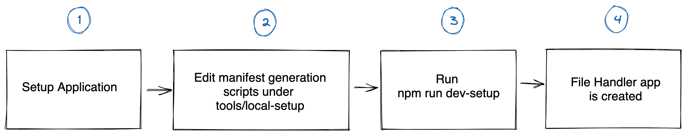
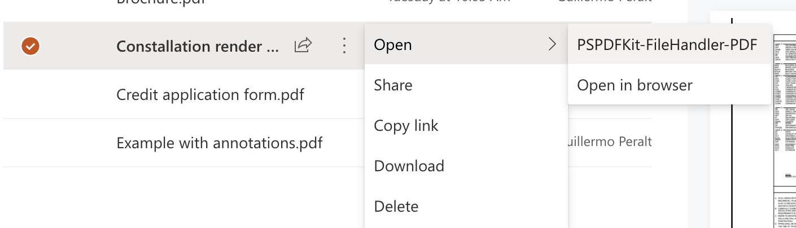
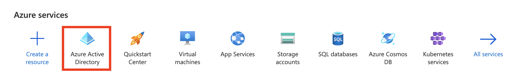
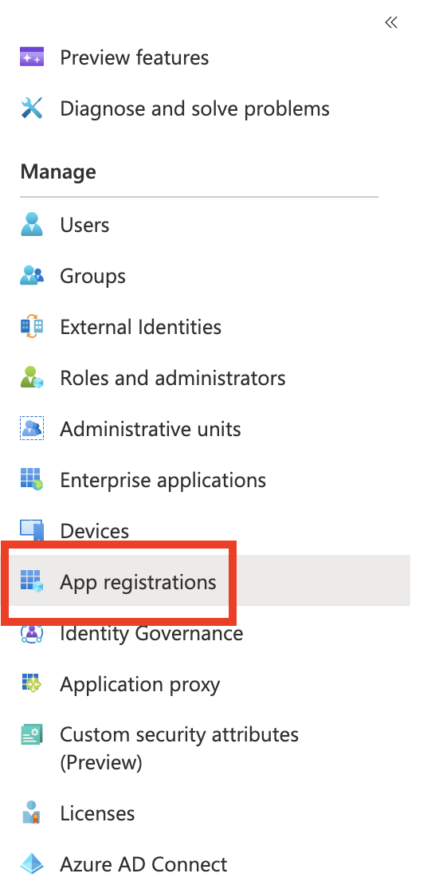
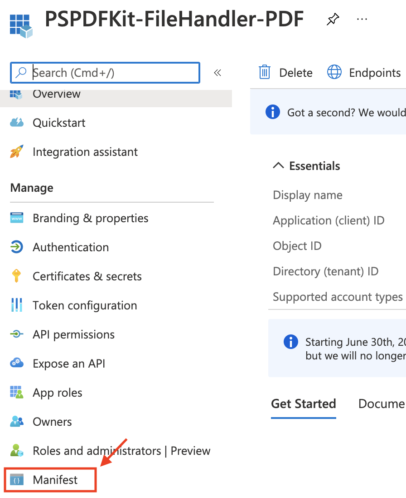

# PSPDFKit PDF File Handler

This is a [Next.js](https://nextjs.org/) application that serves as a native file handler of PDF files for SharePoint sites. Concretely, this server handles requests to open PDF files from a SharePoint site and then proceeds to render a HTML page containing the PSPDFKit for Web Standalone viewer.

This project is based on the [Markdown Filehandler example project](https://github.com/pnp/contoso/tree/main/filehandler).

## Installation and development deployment

After cloning this repository, and before starting the development setup process, it's worth getting a hand on how the architecture of the file handler works.



> **Note:** The "Setup Application" above is a special helper application that needs to be registered in the Azure App Directory, but doesn't represent the File Handler app, it's a helper to automate the process of creation of the actual File Handler. This helper app, can be later removed from the environment safely.

### Manifest specification

The file handler server itself is a regular server-side web application that handles requests initiated by SharePoint when the users click on files from the SharePoint Document Library. The main important bit around the file handler is the **manifest** file. The manifest file defines the URL that will handle the requests, how authentication will be handled, as well as what elements will be rendered in the SharePoint UI (e.g. the context menu item).

In this project, the final manifest is generated by a set of TypeScript scripts under the `./tools/local-setup` directory. The entry point is `./tools/local-setup/bin/localsetup.ts`. The result of this series of scripts is the automatic generation of the final file handler application registration in your [Azure Active Directory](https://azure.microsoft.com/en-us/services/active-directory/).

There are certain key aspects that you can customize as part of the manifest:

**Display name of the menu:** To change the string used when a file is selected, go to `ensure-app.ts` and change the value for the `appDisplayName` variable.



**Login URL:** To change the URL that SharePoint will use to handle login, go to `ensure-app.ts` and change the value for `redirectUris`.

**Logout URL:** To change the URL that SharePoint will use to handle logout, go to `ensure-app.ts` and change the value for `logoutUrls`.

**URL to edit a selected file:** To change the URL that SharePoint will use to handle redirection after a file is opened, go to `inject-manifest.ts` and change the value for the `"url"` field as part of the `actions` array (around line 6). Notice how the file extension that our file handler will operate on as well as other metadata are also defined here.

Once these aspects are defined, we can proceed with the development environment prepation for the file handler.

Notice that by default we're defining `localhost:3000`, so that SharePoint for now will always use that URL when selecting a file, so we need to have our local dev server running.

Later, there are instructions on how to change that server once a production deployment is made.

### Dev setup

**Step 1.** Make sure Node.js v14 is active and run `npm install`

**Step 2.** You need to setup a file handler app registration and load it with a manifest. To do this you need to be an admin of a SharePoint tenant.

> **Note**:  This app that we're creating manually, is used as a way to automate registration of the actual file handler, this app is not the file handler. At a later step, we don't need this temporal app anymore and we can remove it from our Azure.

**Step 2.1.** Sign in to the [Azure portal](https://portal.azure.com/)

**Step 2.2.** Switch to the tenant in which you want to register the application, if you have many tenants.

**Step 2.3.** Select **Azure Active Directory**.

**Step 2.4.** Under **Manage**, select **App registrations** > **New registration**.

**Step 2.5.** Give it an easy to find name (e.g. "filehandler localdev setup")

**Step 2.6.** Add permissions:

* Graph: Delegated: `openid`, `Directory.AccessAsUser.All`

* consent to the permissions

**Step 2.7.** Under the Authentication section:

* Add a platform:

  * Add mobile and desktop applications

  * Select (MSAL only) option in list of redirect uris

* Set "Default client type" to treat app as public client "Yes". **_Please make sure this step is not skipped, as otherwise the whole process fails later when running our `dev-setup` script._**

**Step 2.8.** Take an note of the **client id** of the app and th **tenant id**

**Step 3.** Make sure [OpenSSL](https://www.openssl.org/) is installed in your system, and then run `npm run dev-setup`, supply the **client id** and **tenant id** when prompted. Follow the on screen prompts to complete the device-code auth flow.

> **Note:** It takes 24-48 hours for new file handlers to appear in the UI. You can [follow these steps for clearing the cache](https://docs.microsoft.com/en-us/onedrive/developer/file-handlers/reset-cache?view=odsp-graph-online) to speed this up for development.

**Step 4.** Once setup you can optionally delete the registration helper application, or leave it in place for future use.

**Step 5.** Running the `dev-setup` command in step 4 generates an ".env.local" file in the root of this project. Review the values and ensure it was created correctly. It should appear similar to below:

```
IRON_SESSION_PASSWORD='{anything you want}'
NODE_ENV='production'
AAD_MSAL_AUTH_TENANT_ID="{app tenant id from step 3.9}"
AAD_MSAL_AUTH_ID="{app client id from step 3.9}"
AAD_MSAL_AUTH_SECRET="{app secret from step 3.9}"
NEXT_PUBLIC_FILEHANDLER_SITE_HOST_URL="https://localhost:3000"
```

**Step 6.** Run `npm run dev` and launch the file handler from within OneDrive or a SharePoint document library on a `.pdf` file.

### Production deployment

These steps you need to follow when you want to upload the file handler into some production server, after development.

Step 1. Run `npm run build`

Step 2. Deploy the Next.js application somewhere. For this, you can use [Vercel](https://vercel.com/), [Heroku](https://levelup.gitconnected.com/deploy-your-next-js-app-to-heroku-in-5-minutes-255e829a9966?gif=true), [AWS Amplify](https://aws.amazon.com/it/blogs/mobile/host-a-next-js-ssr-app-with-real-time-data-on-aws-amplify/), [Digital Ocean](https://docs.digitalocean.com/tutorials/app-nextjs-deploy/), or other [self-hosting options](https://nextjs.org/docs/deployment#self-hosting).

Step 3. Sign in to the [Azure portal](https://portal.azure.com/)

Step 4. Go to the Azure Active Directory.



Step 5. Follow the "App registrations" link in the sidebar, as shown in the screenshot below..



Step 6. Select your existing application (created from step 3 of the development setup).

Step 7. Select "Manifest" from the sidebar, as shown in the screenshot below.



Step 8. Once in the manifest editor, search for the `logoutUrl` property and replace its value with the same path but pointing to your production domain instead (the one where your application was deployed to on step 2). Also search for the `replyUrlsWithType` array and for objects with the `url` key replace it to also point to your domain (but maintaining the path).

Step 9. Click on "Save".

> **Note:** It will take 24-48 hours for the manifest change to take effect. You can [follow these steps for clearing the cache](https://docs.microsoft.com/en-us/onedrive/developer/file-handlers/reset-cache?view=odsp-graph-online) to speed this up.

## Project structure

This project follows the basic structure of a [Next.js](https://nextjs.org/) project.

The routes follow the directory structure under the `pages` folder. Notice the `api` directory that contain routes that serve as an API layer, unlike the other routes (the React components with `.tsx` extension) that contain the templates and view logic, as well as code that will run both server-side and client-side.

The `./pages/auth/[actions].ts` file contains the logic that handles login and logout (through [MSAL](https://docs.microsoft.com/en-us/azure/active-directory/develop/msal-overview) - the Microsoft Authentication Library). It leverages the Next.js [dynamic routes feature](https://nextjs.org/docs/routing/dynamic-routes) to be able to combine both the `auth/login` and `auth/logout` paths.

The main route though for the PDF viewer is under `./pages/pdf/[action].tsx` file. It handles requests to `/pdf/edit` path. When the file handler is correctly installed, requests to open a file from the SharePoint library are redirected to that path, with additional query params in the URL.
